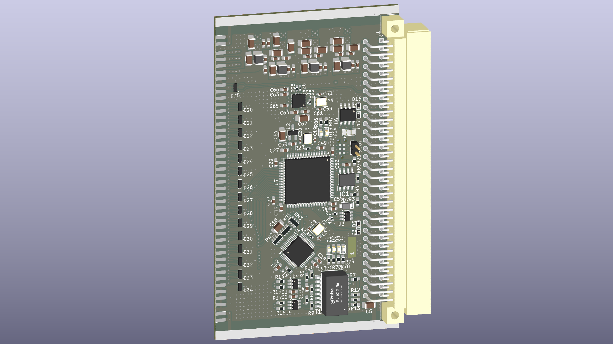

# UCB (Universal Control Board)
Control board for testing concepts with SCPI, UART, USB, RS485 and ETHERNET in 3U eurocard format

---
## Status : WIP

- Schematic and PCB design

---
## Features:
- ARM Cortex-M33 Processor in LQFP100 (STM32H563VIT6) 
- USB 2.0
- 10/100 Ethernet (based on WIZnet W5500)
- UART
- Half-duplex RS485 
- 3U eurocard IEEE 1101.1-1998 format (160x100 mm)
----

## License and Contribution

[MIT License](/LICENSE)

Open to contributions in both software and hardware!
