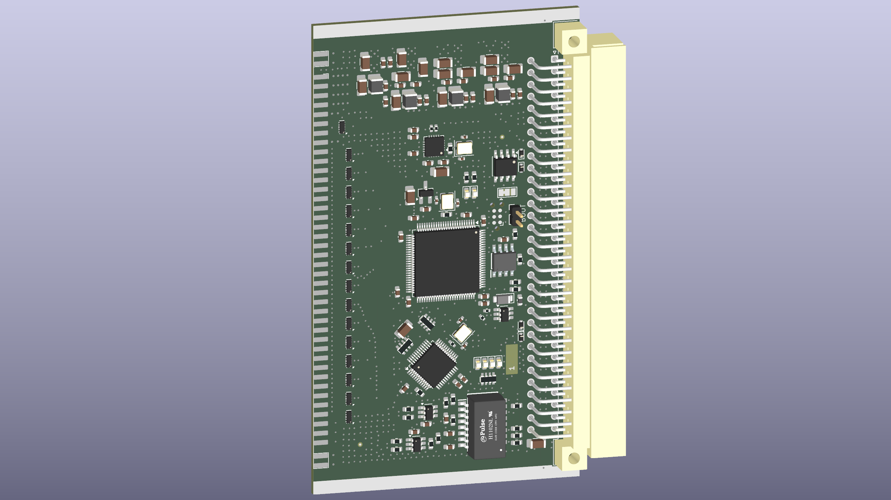
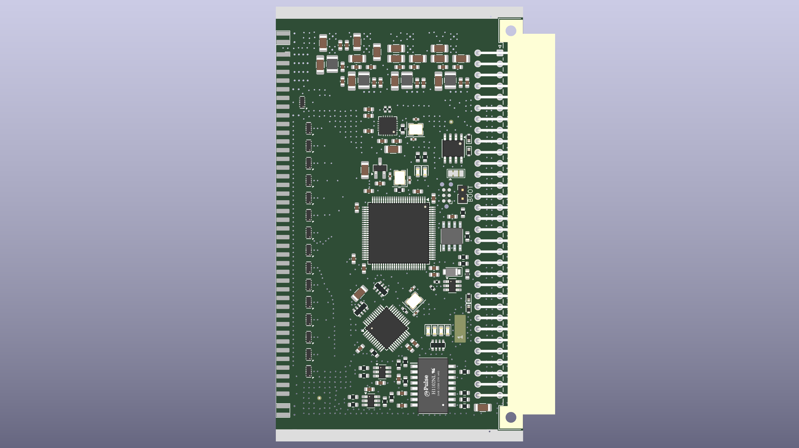
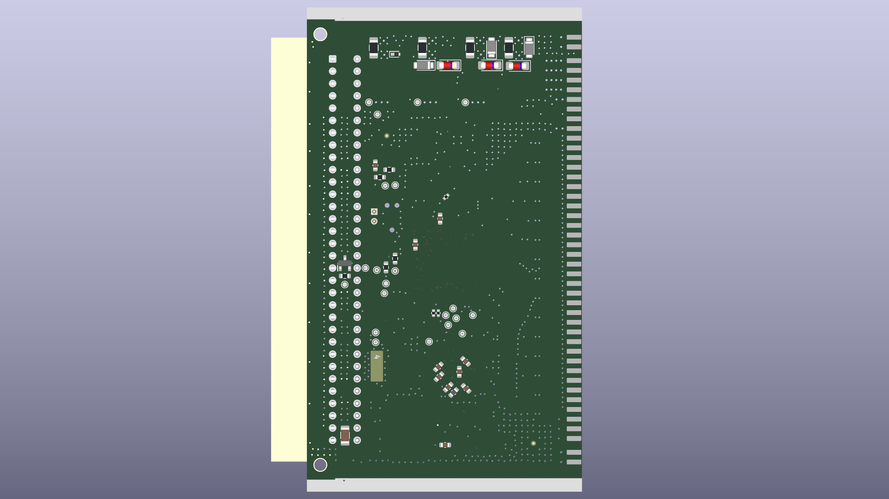

# UCB (Universal Control Board)
Control board for testing concepts with SCPI, UART, USB, RS485 and ETHERNET in 3U eurocard format

| Top | Bottom |
|---|---|
|  |  |

---
## Status: ready for prototype order

- Schematic and PCB layout done (4-layer, 56.8 × 100 mm), production files generated.
- Design review completed; DRC/ERC clean (remaining items reviewed and excluded as by-design).
- W5500 clock is sourced from the MCU (MCO1) by default — R80 fitted, R23 (Si5351C CLK0) DNP.
- Firmware: STM32CubeMX skeleton only.

Production outputs: [schematic PDF](prod/sch/UCB_board.pdf) · [PCB PDF](prod/pcb/UCB_board.pdf) · [interactive BOM](prod/ibom/UCB_board_ibom.html) · [gerbers](prod/UCB_board.zip)

---
## Features:
- ARM Cortex-M33 Processor in LQFP100 (STM32H563VIT6) 
- USB 2.0
- 10/100 Ethernet (based on WIZnet W5500)
- UART
- Half-duplex RS485 
- 3U eurocard IEEE 1101.1-1998 format (160x100 mm) — this 56.8 × 100 mm backend board is combined with a 100 × 100 mm front module (e.g. SSM_board)
----

## License and Contribution

[MIT License](/LICENSE)

Open to contributions in both software and hardware!
